# Barcode Reader System Workflow

## 1. Goal

웹에서 사용자가 1개 이상의 이미지를 업로드하면 시스템은 각 이미지에서 바코드를 탐지하고 리딩한다.
지원 대상은 우선 Data Matrix와 QR Code를 기본으로 하며, 이후 Code128, EAN, PDF417 등으로 확장할 수 있다.
분석 결과는 CSV 파일로 다운로드할 수 있어야 한다.

## 2. User Workflow

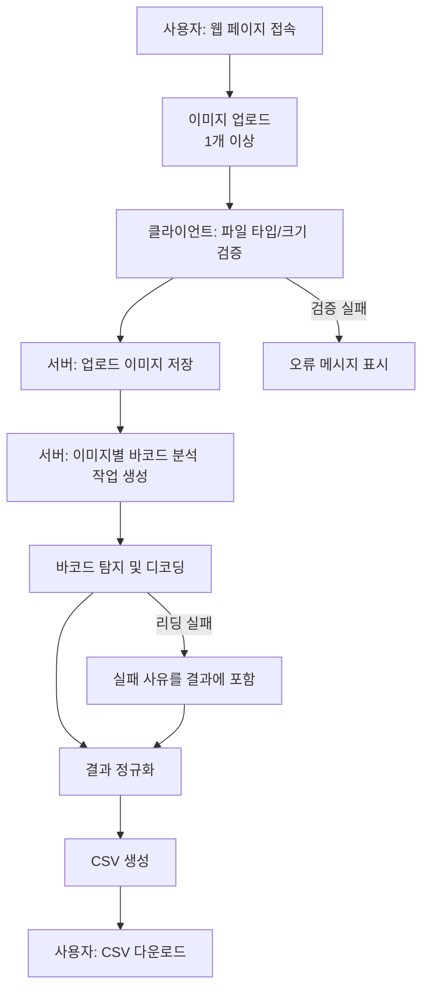

## 3. Recommended System Architecture

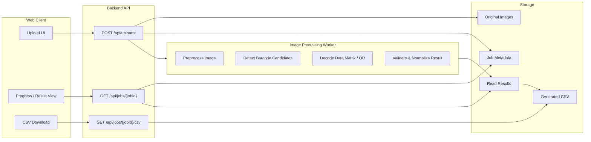

## 4. Processing Pipeline

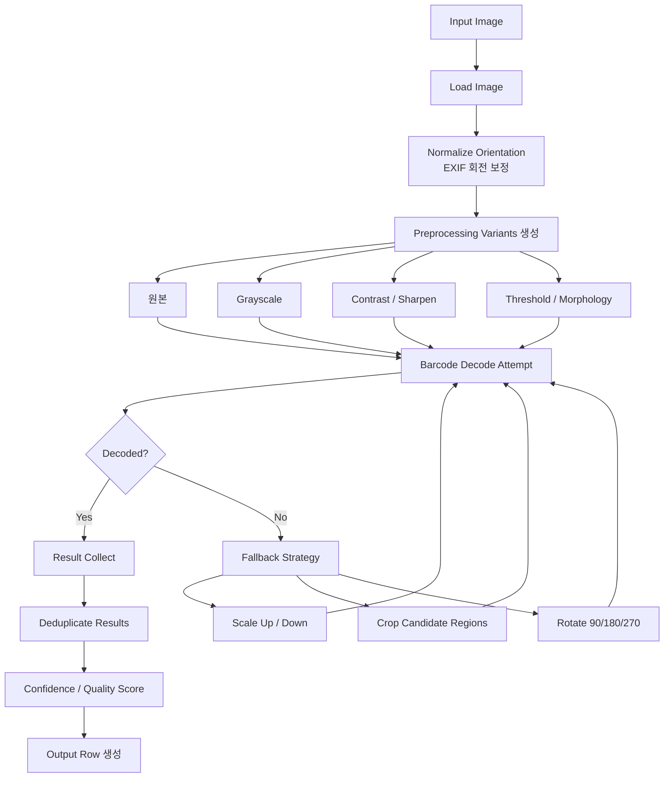

## 5. Barcode Reader Strategy

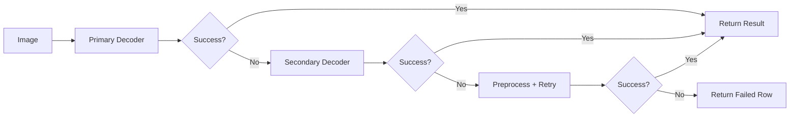

권장 디코더 후보:

- Data Matrix: `pylibdmtx`, `libdmtx`, `ZXing`
- QR Code: `OpenCV QRCodeDetector`, `ZXing`, `pyzbar`
- 공통 전처리: `OpenCV`

초기 구현은 2개 이상의 디코더를 조합하는 방식이 좋다. 실제 촬영 이미지는 해상도, 기울기, 조명, 반사, 초점 상태가 달라서 단일 라이브러리만으로는 누락이 생길 수 있다.

## 6. Backend Job Lifecycle

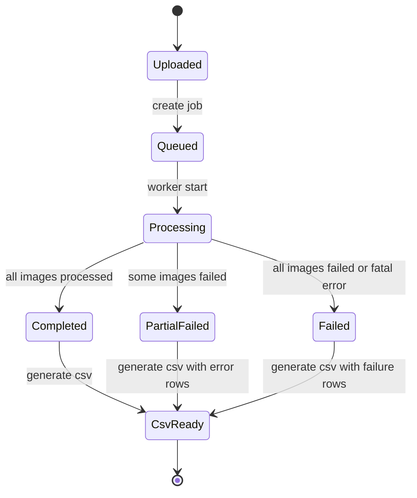

## 7. Sequence Flow

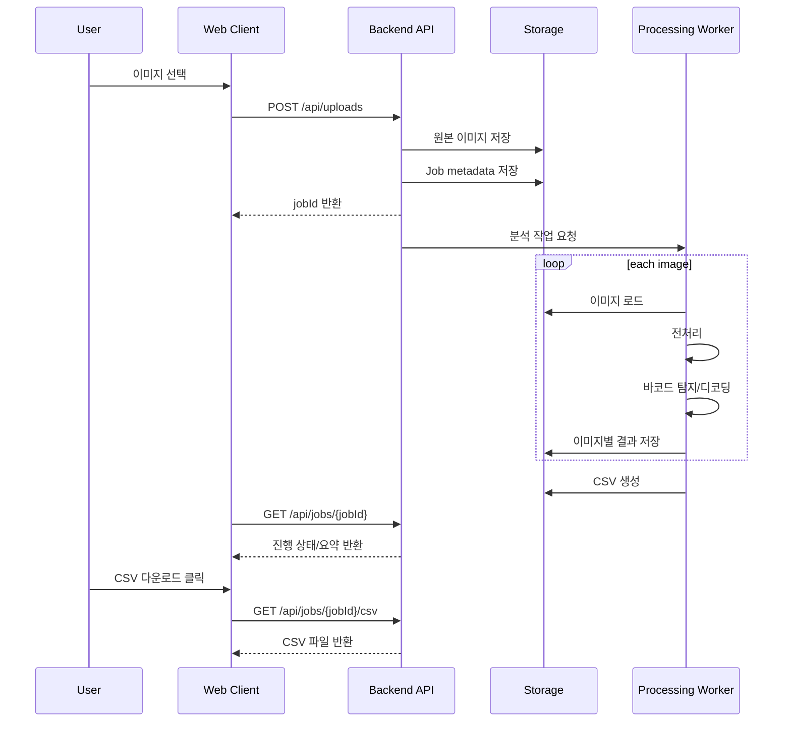

## 8. CSV Output Schema

CSV는 성공/실패를 모두 한 줄로 표현한다. 실패 이미지도 누락하지 않아야 사용자가 어떤 파일이 처리되지 않았는지 알 수 있다.

| Column | Description | Example |
| --- | --- | --- |
| `job_id` | 업로드 작업 ID | `job_20260506_001` |
| `source_filename` | 원본 파일명 | `image_01.jfif` |
| `image_index` | 업로드 순서 | `1` |
| `barcode_index` | 한 이미지 안의 바코드 순서 | `1` |
| `barcode_type` | 인식된 바코드 타입 | `DataMatrix`, `QRCode` |
| `decoded_text` | 리딩 결과 문자열 | `ABC123456` |
| `confidence` | 내부 품질 점수, 없으면 빈 값 | `0.92` |
| `bbox_x` | 바코드 영역 x 좌표 | `120` |
| `bbox_y` | 바코드 영역 y 좌표 | `80` |
| `bbox_width` | 바코드 영역 너비 | `64` |
| `bbox_height` | 바코드 영역 높이 | `64` |
| `status` | `success`, `not_found`, `decode_failed`, `error` | `success` |
| `error_message` | 실패/오류 사유 | `barcode not found` |

예시:

```csv
job_id,source_filename,image_index,barcode_index,barcode_type,decoded_text,confidence,bbox_x,bbox_y,bbox_width,bbox_height,status,error_message
job_20260506_001,image_01.jfif,1,1,DataMatrix,ABC123456,0.92,120,80,64,64,success,
job_20260506_001,image_02.jfif,2,,,,,,,,,,not_found,barcode not found
```

## 9. API Workflow

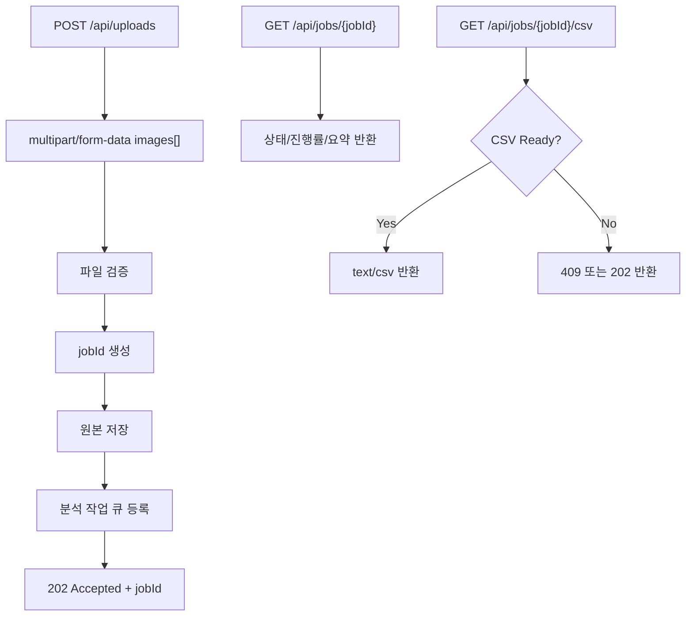

권장 엔드포인트:

- `POST /api/uploads`
  - 입력: `multipart/form-data`, field name: `images`
  - 출력: `{ "jobId": "...", "status": "queued" }`
- `GET /api/jobs/{jobId}`
  - 출력: 상태, 전체 이미지 수, 완료 수, 성공 수, 실패 수
- `GET /api/jobs/{jobId}/csv`
  - 출력: CSV 파일

## 10. Data Model

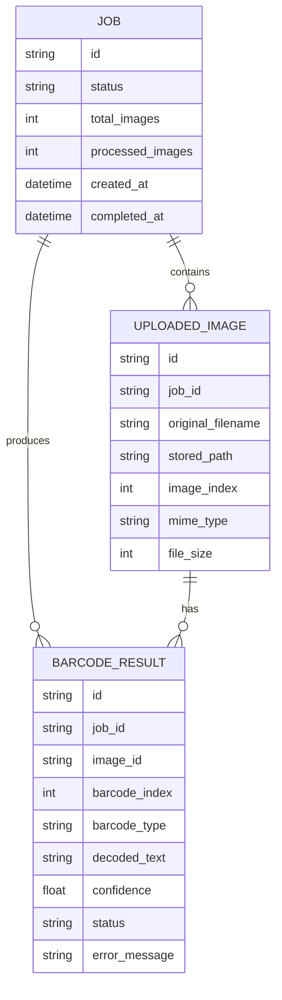

## 11. Development Workflow

```mermaid
flowchart TD
    P0["Phase 0<br/>요구사항/샘플 정리"] --> V0{"Phase 0 검증<br/>샘플 기준 확정"}
    V0 -->|Pass| P1["Phase 1<br/>Decoder PoC"]
    V0 -->|Fail| P0

    P1 --> V1{"Phase 1 검증<br/>디코더 선택 가능"}
    V1 -->|Pass| P2["Phase 2<br/>Core Processing Library"]
    V1 -->|Fail| P1

    P2 --> V2{"Phase 2 검증<br/>Core API 안정화"}
    V2 -->|Pass| P3["Phase 3<br/>CSV Result Engine"]
    V2 -->|Fail| P2

    P3 --> V3{"Phase 3 검증<br/>CSV 스키마 통과"}
    V3 -->|Pass| P4["Phase 4<br/>Backend API + Job"]
    V3 -->|Fail| P3

    P4 --> V4{"Phase 4 검증<br/>API 통합 통과"}
    V4 -->|Pass| P5["Phase 5<br/>Web Upload UI"]
    V4 -->|Fail| P4

    P5 --> V5{"Phase 5 검증<br/>브라우저 E2E 통과"}
    V5 -->|Pass| P6["Phase 6<br/>Quality / Reliability"]
    V5 -->|Fail| P5

    P6 --> V6{"Phase 6 검증<br/>회귀/부하 통과"}
    V6 -->|Pass| P7["Phase 7<br/>Deploy / Operations"]
    V6 -->|Fail| P6

    P7 --> V7{"Phase 7 검증<br/>운영 Smoke Test 통과"}
    V7 -->|Fail| P7
```

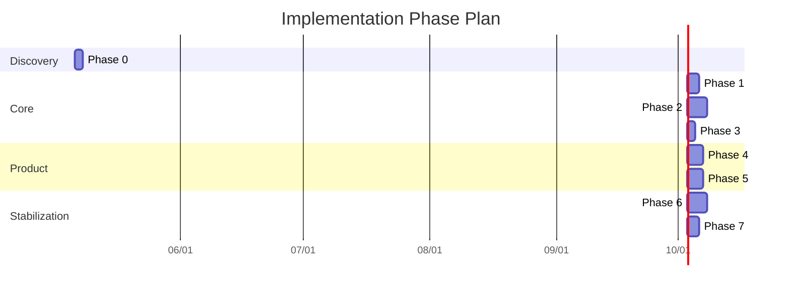

위 일정은 초기 구현 기준의 예시이다. 실제 일정은 샘플 이미지 난이도, 요구 정확도, 대량 처리량, 배포 환경에 따라 조정한다.

### Codex Agent References

각 Phase를 구현할 때 Codex는 아래 `agent.md`를 먼저 참조한다.

| Phase | Agent Guide |
| --- | --- |
| Phase 0: Requirements and Sample Baseline | [agents/phase-0-requirements/agent.md](agents/phase-0-requirements/agent.md) |
| Phase 1: Decoder PoC | [agents/phase-1-decoder-poc/agent.md](agents/phase-1-decoder-poc/agent.md) |
| Phase 2: Core Processing Library | [agents/phase-2-core-processing/agent.md](agents/phase-2-core-processing/agent.md) |
| Phase 3: CSV Result Engine | [agents/phase-3-csv-result-engine/agent.md](agents/phase-3-csv-result-engine/agent.md) |
| Phase 4: Backend API and Job Processing | [agents/phase-4-backend-api-job/agent.md](agents/phase-4-backend-api-job/agent.md) |
| Phase 5: Web Upload UI | [agents/phase-5-web-upload-ui/agent.md](agents/phase-5-web-upload-ui/agent.md) |
| Phase 6: Quality and Reliability | [agents/phase-6-quality-reliability/agent.md](agents/phase-6-quality-reliability/agent.md) |
| Phase 7: Deploy and Operations | [agents/phase-7-deploy-operations/agent.md](agents/phase-7-deploy-operations/agent.md) |

### Phase 0: Requirements and Sample Baseline

목표:

- 처리 대상 바코드 종류를 확정한다. 초기 범위는 `DataMatrix`, `QRCode`로 둔다.
- `sample_images`의 이미지별 기대 결과를 정리한다.
- CSV 컬럼과 실패 row 정책을 확정한다.

구현 작업:

- `sample_images` 파일 목록과 이미지 품질을 확인한다.
- 이미지별로 `expected_results.csv` 또는 테스트 fixture를 만든다.
- 지원 파일 타입, 최대 파일 크기, 1회 업로드 최대 개수를 정의한다.
- 동일 이미지 안에 여러 바코드가 있을 때 여러 row로 출력한다는 원칙을 확정한다.

산출물:

- 샘플 이미지 분석표
- 기대 리딩값 목록
- CSV 스키마 확정안
- 업로드 제한 정책

완료 기준:

- 모든 샘플 이미지가 테스트 케이스로 등록되어 있다.
- 성공, 미검출, 디코딩 실패, 시스템 오류의 출력 정책이 문서화되어 있다.

검증 단계:

- `sample_images`의 전체 파일 수와 파일명을 기록하고 누락이 없는지 확인한다.
- 각 샘플 이미지에 대해 기대값을 `success`, `not_found`, `decode_failed` 중 하나로 분류한다.
- CSV 헤더와 예시 row를 리뷰해서 후속 Phase에서 바뀌지 않을 최소 스키마를 확정한다.
- 업로드 제한 정책이 UI/API 양쪽에서 구현 가능한 값인지 확인한다.

### Phase 1: Decoder PoC

- `sample_images`의 모든 이미지를 대상으로 로컬 스크립트에서 리딩을 시도한다.
- Data Matrix, QR Code 각각 어떤 라이브러리가 가장 잘 읽는지 비교한다.
- 결과는 `source_filename`, `barcode_type`, `decoded_text`, `status` 형태로 먼저 고정한다.

구현 작업:

- OpenCV 기반 이미지 로딩 코드를 작성한다.
- Data Matrix 후보 디코더를 테스트한다. 예: `pylibdmtx`, `ZXing`
- QR 후보 디코더를 테스트한다. 예: `OpenCV QRCodeDetector`, `pyzbar`, `ZXing`
- 디코더별 성공/실패 결과와 처리 시간을 기록한다.

산출물:

- 로컬 PoC 스크립트
- 디코더별 성능 비교표
- 초기 리딩 결과 CSV

완료 기준:

- `sample_images` 전체에 대해 자동 실행이 가능하다.
- 어떤 디코더 조합을 1차 구현에 사용할지 결정되어 있다.

검증 단계:

- PoC 스크립트를 한 번의 명령으로 실행해 모든 샘플 이미지를 처리한다.
- PoC 결과를 Phase 0의 기대 리딩값과 비교한다.
- 디코더별 성공률, 실패 파일 목록, 평균 처리 시간을 기록한다.
- 선택한 디코더 조합으로 `DataMatrix`, `QRCode` 각각 최소 1개 이상의 성공/실패 케이스를 설명할 수 있는지 확인한다.

### Phase 2: Core Processing Library

- EXIF orientation 보정
- grayscale 변환
- contrast/sharpen 적용
- adaptive threshold 적용
- 확대/축소 재시도
- 90도 단위 회전 재시도
- 여러 바코드가 있는 이미지 처리

구현 작업:

- 이미지 입력을 받아 표준 결과 객체를 반환하는 core 함수를 만든다.
- 원본, grayscale, threshold, sharpen 등 전처리 variant를 순차적으로 시도한다.
- 회전, 확대/축소, crop candidate 재시도 전략을 추가한다.
- 동일 바코드 중복 결과를 제거한다.
- bbox 좌표를 가능한 범위에서 반환한다.

산출물:

- `read_barcodes(image) -> BarcodeResult[]` 형태의 core API
- 전처리 pipeline
- 디코딩 실패 사유 코드

완료 기준:

- 웹/API 없이 로컬 함수만으로 이미지 리딩과 결과 객체 생성이 가능하다.
- 실패 이미지도 예외로 중단되지 않고 실패 결과로 변환된다.

검증 단계:

- `read_barcodes(image)` 단위 테스트를 작성해 `success`, `not_found`, `decode_failed`, `error` 결과를 확인한다.
- 깨진 이미지나 지원하지 않는 이미지가 들어와도 프로세스가 중단되지 않는지 확인한다.
- 전처리 variant별 시도 순서와 최종 성공 variant가 로그 또는 debug 결과로 추적되는지 확인한다.
- 동일 바코드 중복 제거가 동작하고, 서로 다른 여러 바코드는 여러 결과로 유지되는지 확인한다.
- bbox가 반환되는 경우 이미지 크기 범위를 벗어나지 않는지 검증한다.

### Phase 3: CSV Result Engine

목표:

- 여러 이미지의 리딩 결과를 정해진 CSV 스키마로 안정적으로 변환한다.
- 성공/실패/부분 성공 케이스를 모두 같은 CSV 파일에 담는다.

구현 작업:

- `BarcodeResult` 객체를 CSV row로 변환한다.
- 한 이미지에서 여러 바코드가 나온 경우 `barcode_index`를 부여한다.
- 바코드가 없는 이미지도 `not_found` row를 생성한다.
- CSV 인코딩은 기본 `UTF-8`로 한다.
- Excel 호환성이 중요하면 `UTF-8 BOM` 옵션을 검토한다.

산출물:

- CSV 생성 모듈
- 샘플 결과 CSV
- CSV schema 테스트

완료 기준:

- `sample_images` 전체 처리 결과를 단일 CSV로 생성할 수 있다.
- 필수 컬럼 누락, row 누락, 깨진 텍스트가 없다.

검증 단계:

- CSV 헤더가 확정 스키마와 정확히 일치하는지 테스트한다.
- 성공 결과, 미검출 결과, 디코딩 실패 결과, 시스템 오류 결과가 모두 row로 생성되는지 확인한다.
- `decoded_text`에 쉼표, 따옴표, 줄바꿈이 포함되어도 CSV escaping이 깨지지 않는지 확인한다.
- 한 이미지에 여러 결과가 있을 때 `barcode_index`가 순서대로 부여되는지 확인한다.
- 생성된 CSV를 스프레드시트 도구에서 열어 인코딩과 컬럼 분리가 정상인지 확인한다.

### Phase 4: Backend API and Job Processing

목표:

- 웹에서 이미지를 업로드하고, 서버가 분석 작업을 생성/추적할 수 있게 한다.

구현 작업:

- `POST /api/uploads` 구현
- `GET /api/jobs/{jobId}` 구현
- `GET /api/jobs/{jobId}/csv` 구현
- 업로드 파일 검증과 저장 경로 정책 구현
- Job 상태 모델 구현: `queued`, `processing`, `completed`, `partial_failed`, `failed`
- 초기 버전은 동기 처리로 시작하고, 처리 시간이 길면 worker queue로 분리한다.

산출물:

- Backend API
- Job metadata 저장소
- 업로드 이미지 저장소
- CSV 다운로드 응답

완료 기준:

- API만으로 다중 이미지 업로드부터 CSV 다운로드까지 실행할 수 있다.
- 서버 오류가 발생해도 job 상태와 error row가 남는다.

검증 단계:

- `POST /api/uploads`에 정상 이미지 여러 장을 업로드해 `jobId`가 반환되는지 확인한다.
- 빈 업로드, 지원하지 않는 확장자, 제한 초과 파일이 올바른 오류 응답을 반환하는지 확인한다.
- `GET /api/jobs/{jobId}`가 `queued`, `processing`, 완료 계열 상태를 일관되게 반환하는지 확인한다.
- CSV가 준비되기 전 `GET /api/jobs/{jobId}/csv` 요청이 정의된 상태 코드와 메시지를 반환하는지 확인한다.
- 동시에 여러 job을 생성해도 결과와 CSV가 서로 섞이지 않는지 확인한다.

### Phase 5: Web Upload UI

- 다중 이미지 업로드 UI
- 업로드 진행 상태 표시
- job 상태 polling
- CSV 다운로드 버튼
- 파일 타입 제한: `jpg`, `jpeg`, `png`, `bmp`, `tiff`, `jfif`
- 파일 크기 제한 및 업로드 개수 제한

구현 작업:

- 이미지 선택/드래그 앤 드롭 UI를 만든다.
- 선택한 파일 목록, 크기, 검증 결과를 보여준다.
- 업로드 시작, 진행률, 처리 상태를 표시한다.
- 분석 완료 후 요약과 CSV 다운로드 버튼을 제공한다.
- 실패한 파일이 있을 경우 사용자에게 파일명과 사유를 보여준다.

산출물:

- Web upload page
- Job progress view
- CSV download interaction

완료 기준:

- 사용자가 브라우저에서 이미지 여러 장을 올리고 CSV를 받을 수 있다.
- 업로드 실패, 처리 중, 완료, 부분 실패 상태가 UI에서 구분된다.

검증 단계:

- 브라우저에서 `sample_images` 여러 장을 선택해 업로드부터 CSV 다운로드까지 수동으로 확인한다.
- 드래그 앤 드롭, 파일 선택, 선택 취소, 재업로드 흐름이 깨지지 않는지 확인한다.
- 클라이언트 파일 검증 메시지와 서버 검증 오류 메시지가 사용자에게 이해 가능한 문장으로 표시되는지 확인한다.
- job polling 중 새로고침하거나 네트워크가 잠시 실패해도 복구 가능한지 확인한다.
- 데스크톱과 모바일 폭에서 파일 목록, 상태, 다운로드 버튼이 겹치지 않는지 확인한다.

### Phase 6: Quality and Reliability

- 실패 이미지도 CSV에 포함
- 디코딩 오류와 시스템 오류 구분
- 작업별 로그 저장
- 업로드 파일 임시 보관 정책 정의
- 동일 결과 중복 제거
- 대량 이미지 처리 시 worker queue 사용

구현 작업:

- `sample_images` 기반 회귀 테스트를 작성한다.
- 깨진 이미지, 빈 업로드, 지원하지 않는 확장자 테스트를 추가한다.
- 여러 바코드가 있는 이미지, 바코드가 없는 이미지 테스트를 추가한다.
- 처리 시간, 성공률, 실패 사유를 로그로 남긴다.
- 대량 업로드 시 timeout이 발생하지 않도록 worker queue를 검토한다.

산출물:

- 자동 테스트
- 실패 케이스 fixture
- 처리 로그
- retry/fallback 정책

완료 기준:

- 핵심 테스트가 자동화되어 있다.
- 실패 케이스가 사용자에게 설명 가능한 형태로 반환된다.
- 대량 이미지 처리 시 서버 요청이 장시간 block되지 않는다.

검증 단계:

- `sample_images` 기반 회귀 테스트를 CI 또는 로컬 테스트 명령으로 반복 실행한다.
- 깨진 이미지, 바코드 없는 이미지, 여러 바코드 이미지, 매우 큰 이미지 fixture를 포함해 테스트한다.
- 대량 업로드 시 처리 시간, 메모리 사용량, timeout 발생 여부를 기록한다.
- 로그에 `job_id`, `source_filename`, `status`, `error_message`가 남는지 확인한다.
- worker queue를 사용하는 경우 재시도, 실패 처리, 중복 실행 방지가 동작하는지 확인한다.

### Phase 7: Deploy and Operations

목표:

- 실제 사용자가 안정적으로 사용할 수 있는 운영 환경을 준비한다.

구현 작업:

- 배포 환경에서 필요한 native dependency를 정리한다. 예: `libdmtx`, `zbar`, OpenCV runtime
- 업로드 파일 보관 기간과 삭제 정책을 구현한다.
- job/result/csv 보관 기간을 정의한다.
- 운영 로그와 에러 추적을 설정한다.
- 처리량 증가에 대비해 worker scale-out 구조를 준비한다.

산출물:

- 배포 문서
- 환경 변수 목록
- dependency 설치 문서
- 운영/보관 정책

완료 기준:

- 새 환경에서 설치 문서만 보고 서비스를 실행할 수 있다.
- 업로드 파일과 결과 파일이 정책에 따라 정리된다.
- 운영 중 실패 원인을 로그로 추적할 수 있다.

검증 단계:

- 배포 환경에서 native dependency 설치 후 샘플 이미지 smoke test를 실행한다.
- 운영 URL에서 업로드, 상태 조회, CSV 다운로드가 정상 동작하는지 확인한다.
- 파일 보관 기간이 지난 업로드 이미지와 CSV가 삭제되는지 cleanup 동작을 확인한다.
- 장애 상황을 가정해 오류 로그와 job 상태가 추적 가능한지 확인한다.
- 새 환경에서 문서만 보고 서비스를 재설치할 수 있는지 검증한다.

## 12. Error Handling

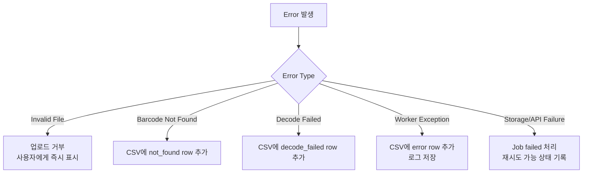

## 13. Testing Workflow

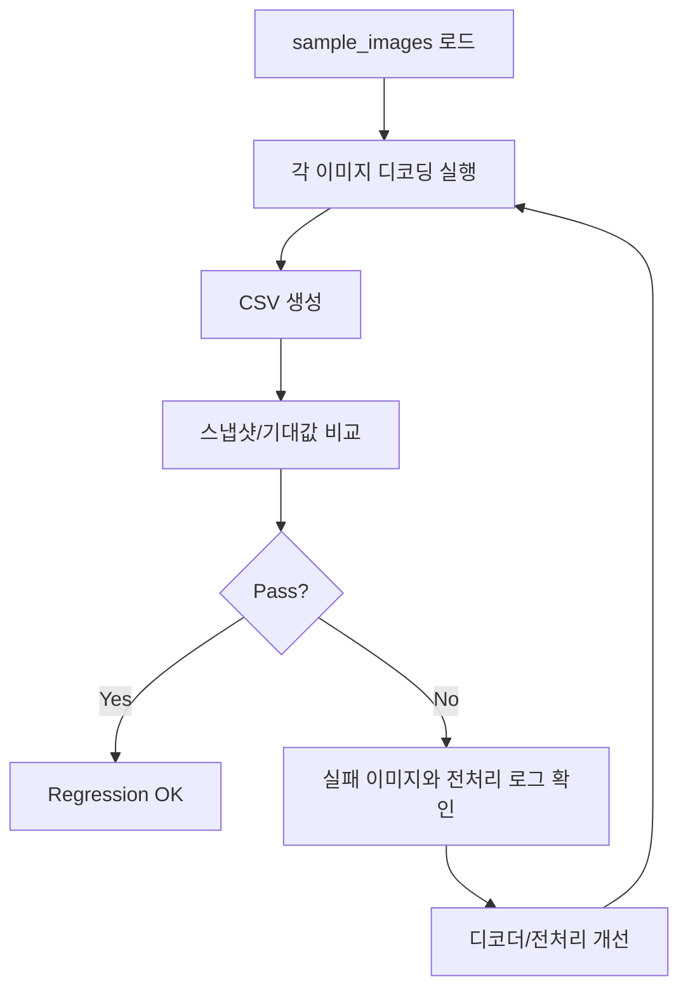

테스트 기준:

- `sample_images`의 모든 파일이 처리 대상에 포함되는지 확인
- 리딩 성공 이미지의 `decoded_text`가 기대값과 일치하는지 확인
- 리딩 실패 이미지도 CSV row로 남는지 확인
- 한 이미지에서 여러 바코드가 발견될 때 여러 row가 생성되는지 확인
- 깨진 이미지, 지원하지 않는 확장자, 빈 업로드 요청을 검증

## 14. Initial Milestone Checklist

- [ ] 샘플 이미지별 기대 리딩값 정리
- [ ] 로컬 디코딩 PoC 구현
- [ ] 전처리 파이프라인 구현
- [ ] CSV 스키마 확정 및 생성 함수 구현
- [ ] 업로드 API 구현
- [ ] Job 상태 조회 API 구현
- [ ] CSV 다운로드 API 구현
- [ ] Web upload UI 구현
- [ ] `sample_images` 기반 회귀 테스트 작성
- [ ] 실패/오류 로그 정책 정의
